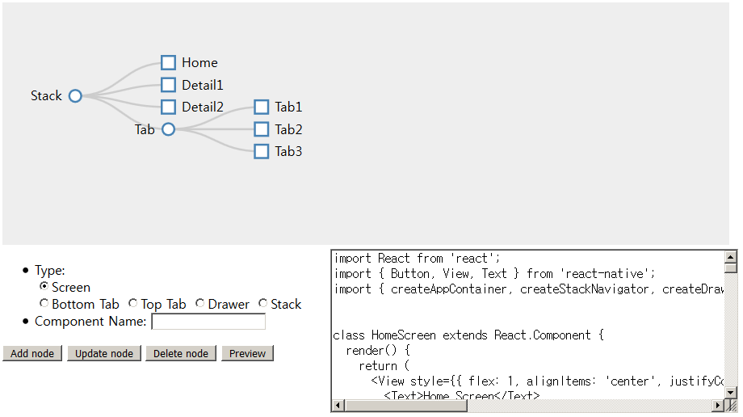

## React Navigation Builder for React-Native ##

This is a simple tool for easily using React-Navigation.

React-Navigation is a library for easy use of React-Native screens, but it is difficult to use.

In RNB9 (React Navigation Builder), if you specify the configuration of the Screen, Tag, and Drawer,

You can generate code that uses that component.

Finally, copy and paste the generated code into React-Native App.js and run it.

### Demo ###
[https://gujc71.github.io/rnb9/](https://gujc71.github.io/rnb9/)
